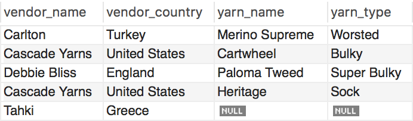

# SQL Joins

## Part 1

* Describe the different types of join clauses supported in SQL.

A full outer join will join all data in two tables even without matching ros. An inner join selects rows from one table that correspond with another table. Left joins select rows from one table that may or may not have corresponding rows in other tables. Cross joins produce a Cartesian product of the rows in multiple tables. Natural joins combine tables based on common column names.

## Part 2

* Consider the following tables:

  * vendor_table
  

  * yarn_table
  

* Which join was used to create the final view below?

  

  A LEFT JOIN was used to create the final view.
