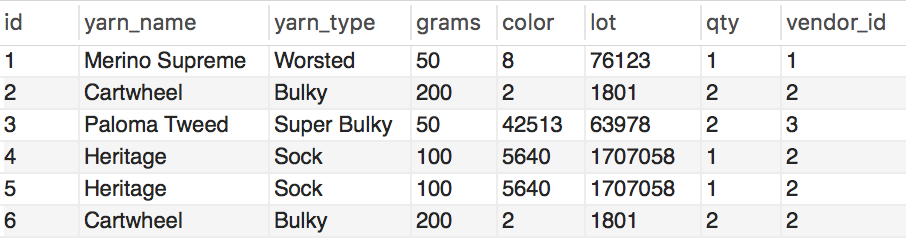

# Duplicates

## Part 1

* How do you locate a duplicate record with one field? Using the table below, write a query to demonstrate.

  * Yarn table with duplicates:

    

DELETE FROM duplicated_yarn
WHERE id IN
    (SELECT id
    FROM 
        (SELECT id,
         ROW_NUMBER() OVER( PARTITION BY yarn_name
        ORDER BY  id ) AS row_num
        FROM duplicated_yarn) y
        WHERE y.row_num > 1 );

## Part 2

* How do you find duplicate records using more than one field? Using the table from Part 1, write a query to demonstrate.

DELETE FROM duplicated_yarn
WHERE id IN
    (SELECT id
    FROM 
        (SELECT id,
         ROW_NUMBER() OVER( PARTITION BY yarn_name,
         yarn_type
        ORDER BY  id ) AS row_num
        FROM duplicated_yarn) y
        WHERE y.row_num > 1 );